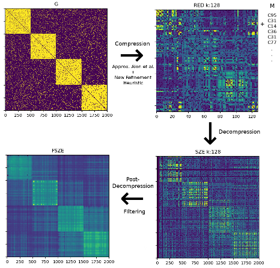

# CoDec

This repo contains the project of my M.Sc. [thesis](https://www.overleaf.com/read/djzbpytftknc).

## Installation

The code runs with `python3.6`.

The packages required are in the file `requirements.txt`, I suggest to create a virtualenv and install the packages by running `pip install -r requirements.txt.` 

## How to run

In order to fully understand how it works you need to hack a little bit the files. To have a demostration just run `python run.py`.
