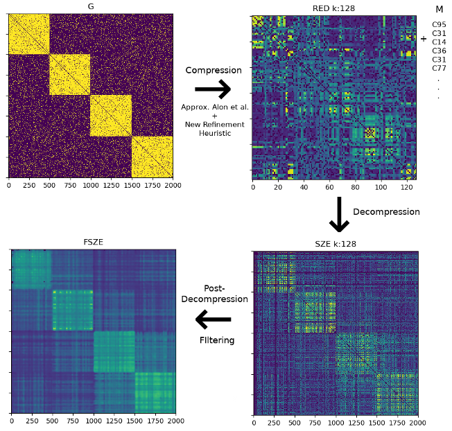

# CoDec

This repo contains the project of my M.Sc. thesis entitled _"Graph Compression Using The Regularity Method"_ accessible on [arXiv](https://arxiv.org/abs/1810.07275).

## Installation

The code runs with `python3.6`.

The packages required are in the file `requirements.txt`, I suggest to create a virtualenv and install the packages by running `pip install -r requirements.txt.` 

## How to run

To have a demostration just run `python run.py`, in order to fully understand I suggest to read the thesis.
